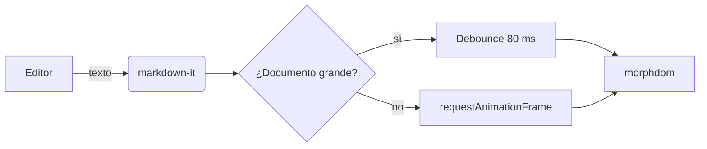

     # Reader

Un lector y editor de **Markdown** rápido, escrito con *Tauri* y `Svelte 5`.

## Qué sabe hacer

- Vista dividida con scroll sincronizado
- Modo lectura a pantalla completa
- Árbol de archivos y esquema del documento
- [x] Resaltado de código
- [x] Fórmulas y diagramas
- [ x] PDF (llega en la Fase 2)

> El presupuesto de arranque es de 400 ms hasta el primer pintado.
> El instalador pesa menos de 15 MB.

## Código

```ts
export function readingMinutes(words: number): number {
  if (words === 0) return 0;
  return Math.max(1, Math.ceil(words / 200));
}
```

```rust
pub fn read_text_sync(path: &str) -> AppResult<TextFile> {
    let bytes = fs::read(path).map_err(|e| AppError::from_io(e, path))?;
    Ok(TextFile::from(bytes))
}
```

## Matemáticas

La energía en reposo es $E = mc^2$, y la integral gaussiana vale:

$$\int_{-\infty}^{\infty} e^{-x^2}\,dx = \sqrt{\pi}$$

## Diagrama



## Tabla

| Métrica | Presupuesto | Medido |
| --- | --- | --- |
| Instalador | < 15 MB | 3.7 MB |
| Binario | menor que Electron | 6.1 MB |

## Notas

Esto lleva una nota al pie[^1] para probar el plugin.

[^1]: Y aquí está el texto de la nota.

---

Fin del documento.
