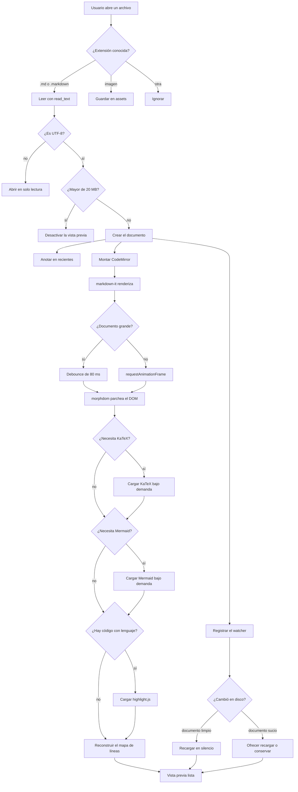

# Diagrama extenso

Este documento existe para probar el visor de diagramas con uno que no cabe en el
panel de la vista previa.

Con el diagrama tan ancho, en la vista previa se ve diminuto. El botón de ampliar
lo abre en el visor, donde se puede acercar, arrastrar y guardar como imagen.
